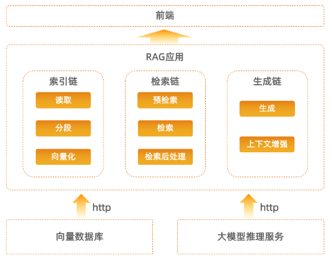
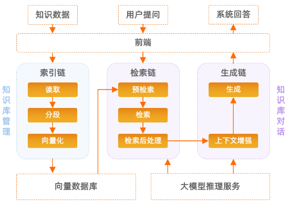

# RAGNIFY概述

## 1. 什么是RAGNIFY？

随着人工智能技术的飞速发展，LLMs（Large Language Models，大型语言模型）已成为NLP（Natural Language Processing，自然语言处理）领域的重要工具。然而，LLMs在知识密集型NLP任务中面临几个关键挑战：

- 实时性：随着信息的快速传播和变化，用户需要模型能够实时更新其知识以提供准确的回答。然而，传统的LLMs无法实时地更新其内部参数来反映新的信息。
- 隐私性：在处理个人或敏感信息时，保护用户隐私至关重要。然而，传统的LLMs可能会将用户输入的信息存储在其训练数据或推理过程中，存在泄露隐私的风险。
- 幻觉问题：传统的LLMs有时会产生不真实或错误的输出，即所谓的“幻觉”。这种幻觉可能会误导用户。

为了克服这些挑战，LLM-RAG（Retrieval-Augmented Generation，检索增强生成）应运而生。业界RAG方案通常具备以下特征：

- 实时性：RAG能够在回答问题之前从外部知识库中检索最新的信息。这使得模型能够实时地更新其知识库，以反映最新的信息，并提供更准确的回答。
- 隐私性：RAG不需要将用户输入的信息存储在模型内部，而是直接从外部知识库中检索相关信息。这减少了隐私泄露的风险，并增强了用户数据的保护。
- 减少幻觉：通过结合外部知识库，RAG能够提供更准确和可靠的信息，减少模型产生幻觉的可能性。外部知识库中的信息通常经过验证和筛选，因此更有可能提供真实和准确的答案。

RAGNIFY则是chuxin-llm团队开发的一个围绕开源大模型生态构建的RAG开发框架。各行业的用户可以在本框架基础上，使用自己的知识库快速搭建本地化/私有化的知识问答系统，实现产品化的知识库管理和对话功能。同时，由于本框架将传统RAG⽅案中较为通⽤的功能组件进⾏了模块化处理，因此开发者们也可以基于本框架快速搭建更加定制化的RAG流程，以满足更加聚焦场景的问答需求。

## 2. RAGNIFY优势

- 支持本地化/私有化部署：用户数据可以保存在本地/私有云，数据安全得以保障。
- 支持多机器部署：向量数据库、大模型推理服务和RAG应用部署在不同机器，服务搭建更灵活，计算资源利用率更高，调试模型更方便。
- 支持面向开发者的流程和模块设计，持续接入前沿技术能力。

## 3. RAGNIFY架构

RAGNIFY具有灵活的模块化设计，将前端、RAG应用、向量数据库、大模型推理服务等组件解耦，方便部署和管理。

  

### 前端

RAGNIFY支持：

- 原生Web UI：您可以在前端界面中上传知识库文件并进行知识问答。
- 定制UI：您可以基于RAGNIFY提供的API适配其它系统的前端，满足定制化UI的诉求。

### RAG应用

RAGNIFY将RAG中常用的数据读取、分段、向量化、预检索、检索、检索后处理、上下文增强、生成等功能进行了模块化的定义，并通过流程链（Chains）对这些功能模块进行组装，从而实现了知识库管理和知识库对话能力。

- **知识库管理**：

  索引链（Indexing Chain）：负责知识数据的读取、分段、向量化，在服务启动或用户新增知识时自动执行。

- **知识库对话**：

  - 检索链（Retrieval Chain）：根据用户输入的问题，在知识库中检索和问题相关的信息并提供给生成链，需要依赖向量数据库、大模型等组件的能力。

  
  - 生成链（Generate Chain）：根据检索得到的内容增强大模型的上下文，调用大模型生成最终结果。

  

### 依赖服务
RAGNIFY主要依赖向量数据库和大模型推理服务，这两个服务以在线形式接入。

- 向量数据库：提供了文档导入、上下文索引、相似度搜索能力，并对向量化的知识数据进行存储。

- 大模型推理服务：提供了根据上下文输入生成答案的能力。

## 4. 相关文档

- [部署指南](docs/deployment.md)：介绍如何安装部署RAGNIFY。
- [使用指南](docs/service.md)：介绍如何使用RAGNIFY搭建知识问答系统。
- [度量指标评估指南](docs/evaluation.md)：介绍如何对RAGNIFY进行度量指标评估。
- [流程监控指南](docs/observability.md)：介绍如何对RAGNIFY全流程中的相关信息进行跟踪监控，包括各模块的输入输出、响应时间等。
- [参数说明](docs/configuration.md)：介绍RAGNIFY相关的参数定义。
- [开发指南](docs/development.md)：介绍如何自定义功能模块并将它配置到RAGNIFY中。
