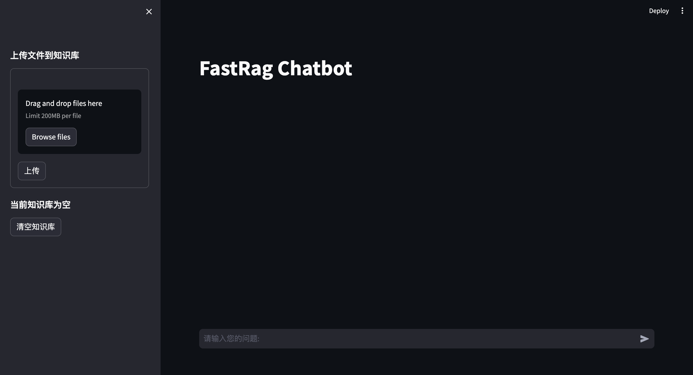
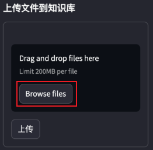
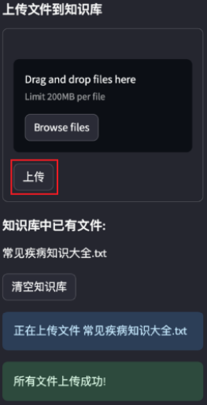
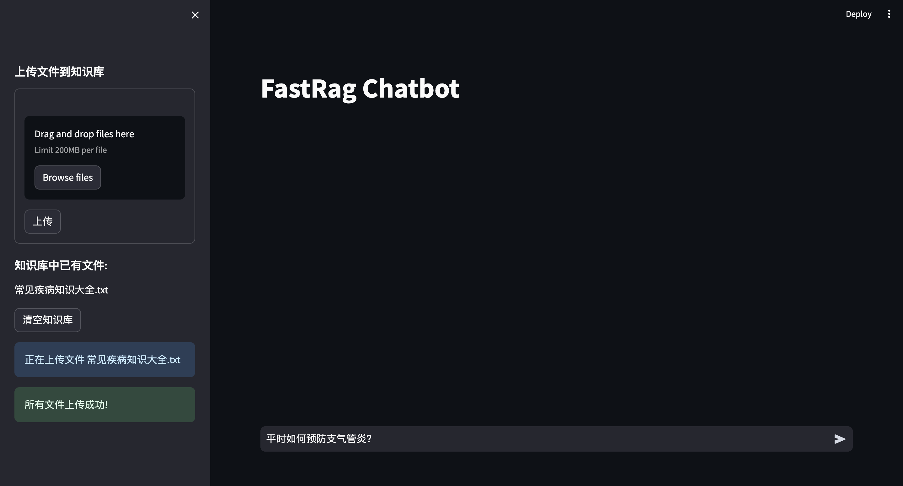
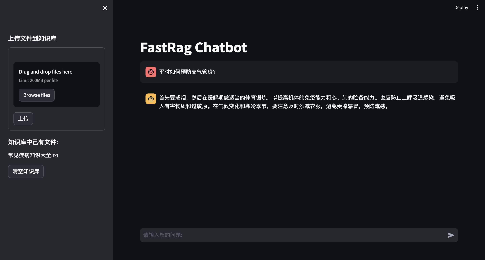
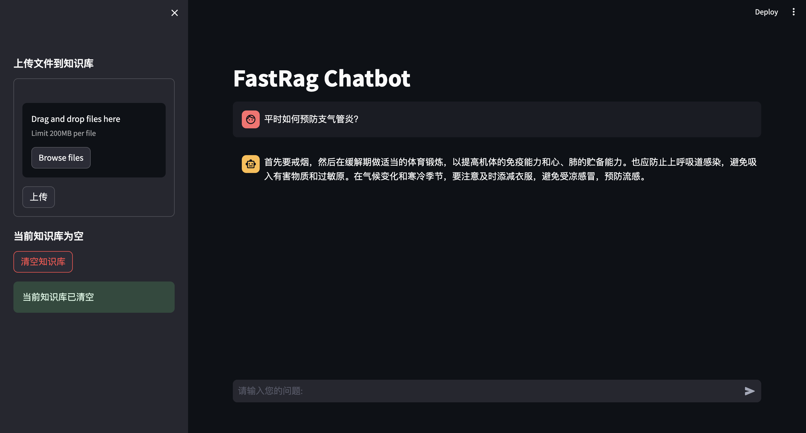

# 使用指南

您可以结合自己的知识库，使用原生Web UI或定制UI搭建本地化的知识问答系统。

## 1 原生Web UI

您可以在RAGNIFY提供的原生Web UI界面上传知识库文件，并进行知识问答。

1. 部署并启动Web UI服务，请参考[部署指南](deployment.md)。

2. 在浏览器中输入 ``http://<host>:<port>``，进入对话界面。

   其中：

   - `<host>`：主机地址。

   - `<port>`：Web UI服务的访问端口。

   <div style="text-align: left;">  </div>

3. 单击**Browse files**，在弹出的对话框中选择需要上传的文件。

   <div style="text-align: left;">  </div>

4. 单击**上传**，上传文件到知识库。

   **说明**：如果上传文件失败，请在本项目中提issue。

   <div style="text-align: left;">  </div>

5. 在页面底部的对话框中，输入相关问题。

   <div style="text-align: left;">  </div>

6. 按下回车键，RAGNIFY会根据输入的问题，返回结果。

   <div style="text-align: left;">  </div>

**其它操作**：清空知识库文件。  
单击**清空知识库**，可以清空知识库的已有文件。

<div style="text-align: left;">  </div>


## 2 定制UI

您可以基于RAGNIFY提供的API适配其它系统的前端，满足定制化UI的诉求。

### 2.1 定制流程

1. 部署并启动后端API服务，请参考[部署指南](docs%2Fdeployment.md)。
2. 编写前端程序，调用RAGNIFY提供的APIs，完成知识库管理和知识库对话的流程搭建：
   
   **知识库管理**：
   
   a. 创建知识库。
   
   b. 上传文件到知识库。
   
   c. 查询知识库列表。
   
   d. 删除知识库。
   
   **知识库对话**：
   
   e. 进行知识库对话。
3. 打开定制UI前端，进行知识库问答。


### 2.2 API使用概述

#### 2.2.1 调用方式

##### 2.2.1.1 请求结构

请求包括：请求URI格式、请求方法、请求消息头及请求消息体等，具体结构如下：

###### 2.2.1.1.1 请求URI格式

请求URI由如下部分组成：

`<URI-scheme>://<ip>:<port>/<resource-path>`

参数说明如下：

| 参数              | 描述                                                         |
| ----------------- | ------------------------------------------------------------ |
| `<URI-scheme>`    | 表示用于传输请求的协议，当前RAGNIFY的所有API均采用**HTTP**协议。 |
| `<ip>`            | 部署后端API服务的IP地址。                                    |
| `<port>`          | 访问后端API服务的端口。                                      |
| `<resource-path>` | 资源路径，即API访问路径。参见**API参考**中的**URI**部分，例如 **“创建知识库”** API的`<resource-path>`为``/knowledge_base/create_knowledge_base``。 |

###### 2.2.1.1.2 请求方法

RAGNIFY的API的HTTP请求方法均为POST，即请求服务器新增资源或执行特殊操作。

Python3格式的请求示例如下：

`response = requests.request("POST", url, headers=headers, data=payload)`

###### 2.2.1.1.3 请求消息头

附加请求头字段，RAGNIFY的API请求只需要指定消息体类型的请求头“Content-Type”。

| 参数         | 描述                                     | 是否必选 | 示例             |
| ------------ | ---------------------------------------- | -------- | ---------------- |
| Content-Type | 消息体的类型（格式）。 | 是       | application/json |

###### 2.2.1.1.4 请求消息体

请求消息体通常以结构化格式（如JSON或XML）发出，与请求消息头中Content-Type对应，传递除请求消息头之外的内容。若请求消息体中的参数支持中文，则中文字符必须为UTF-8编码。

##### 2.2.1.2 返回结果

请求发送以后，您会收到响应，其中包含状态码、响应消息头和消息体。

###### 2.2.1.2.1 状态码

`状态码`是一组形如`xxx`的数字代码，状态码表示了请求响应的状态，RAGNIFY的API Server使用的状态码如下

| 正常状态码 | 说明       |
| :--------- | :--------- |
| 200        | 请求成功。 |

| 错误状态码 | 说明                     |
|:------|:-----------------------|
| 403 | 包含预期外的字符或路径攻击关键字。      |
| 404 | 知识库名称为空/存在同名知识库/知识库不存在。 |
| 500 | 请求错误：创建知识库出错。          |

###### 2.2.1.2.2 响应消息头

对应请求消息头，响应同样也有消息头，如“Content-type”。

以知识库对话接口为例，返回如下表所示的消息头，其中`content-type=text/event-stream; charset=utf-8`代表接口以流式输出文本结果。

| 参数   | 值                             |
|:-----|:------------------------------|
| date | Mon, 13 May 2024 04:02:57 GMT |
|  server    | uvicorn                       |
|   cache-control   | no-cache                      |
|connection| keep-alive                    |
|x-accel-buffering| no                            |
|content-type|text/event-stream; charset=utf-8|
|transfer-encoding|chunked|

### 2.3 API

#### 2.3.1 创建知识库

##### 接口介绍
用于在本地创建一个指定名称的知识库。

##### 注意事项

- 请勿创建同名知识库。
- 知识库名称不允许为空，并且不允许包含`/`字符。

##### 请求路径

`http://<host>:<port>/knowledge_base/create_knowledge_base`

其中：

- `<host>`：主机地址。

- `<port>`：RAGNIFY API服务的访问端口。

##### 请求参数

| 参数名称            | 类型   | 必须 | 说明             |
| :------------------ | :----- | :--- | :--------------- |
| knowledge_base_name | String | 是   | 知识库名称。     |
| vector_store_type   | String | 是   | 向量数据库名称。 |

##### 请求示例

```python
# Python - Requests

import requests
import json

host = "<host>"
port = "<port>"
url = f"http://{host}:{port}/knowledge_base/create_knowledge_base"

payload = json.dumps({
  "knowledge_base_name": "test_rag",
  "vector_store_type": "milvus"
})
headers = {
  'Content-Type': 'application/json'
}

response = requests.request("POST", url, headers=headers, data=payload)

print(response.text) 

```

##### 返回参数

| 名称 | 类型 | 说明          |
| :--- | :--- | :------------ |
| code | int  | 响应码。      |
| msg  | str  | API状态信息。 |

##### 返回示例

```
{
  "code": 200,
  "msg": "已新增知识库 test_rag"
}
```

##### HTTP状态码

| 状态码 | 说明                          |
|:----|:----------------------------|
| 200 | 接口请求成功。                     |
| 403 | 请求错误：包含预期外的字符或路径攻击关键字。      |
| 404 | 请求错误：知识库名称为空/存在同名知识库。 |
| 500 | 请求错误：创建知识库出错。               |

#### 2.3.2 删除知识库

##### 接口介绍

用于删除指定名称的知识库，包括该知识库中所有已切分的文件。

##### 注意事项

- 知识库名称不允许为空，并且不允许包含`/`字符。
- 请确保指定删除的知识库存在。

##### 请求路径

`http://<host>:<port>/knowledge_base/delete_knowledge_basee`

其中：

- `<host>`：主机地址。

- `<port>`：RAGNIFY API服务的访问端口。

##### 请求参数

| 名称                | 类型   | 必须 | 说明         |
| :------------------ | :----- | :--- | :----------- |
| knowledge_base_name | String | 是   | 知识库名称。 |

##### 请求示例

```python
# Python - Requests
import requests
import json

host = "<host>"
port = "<port>"
url = f"http://{host}:{port}/knowledge_base/delete_knowledge_base"

payload = "test_rag"
headers = {
  'Content-Type': 'text/plain'
}

response = requests.request("POST", url, headers=headers, data=payload)

print(response.text)
```

##### 返回参数

| 名称 | 类型 | 说明          |
| :--- | :--- | :------------ |
| code | int  | 响应码。      |
| msg  | str  | API状态信息。 |

##### 返回示例

```
{
  "code": 200,
  "msg": "success"
}
```

##### HTTP状态码

| 状态码 | 说明                                         |
| :----- | :------------------------------------------- |
| 200    | 请求成功，已删除指定知识库。                 |
| 403    | 请求错误：包含预期外的字符或路径攻击关键字。 |
| 404    | 请求错误：未找到知识库。                     |
| 500    | 请求错误：删除知识库过程中出错。             |

#### 2.3.3 查询知识库列表

##### 接口介绍

查询系统中已创建的所有知识库，返回知识库名称列表。

##### 注意事项

无

##### 请求路径

`http://<host>:<port>/knowledge_base/list_knowledge_bases`

其中：

- `<host>`：主机地址。

- `<port>`：RAGNIFY API服务的访问端口。

##### 请求参数

`无`

##### 请求示例

```python
import requests

host = "<host>"
port = "<port>"
url = f"http://{host}:{port}/knowledge_base/list_knowledge_bases"

payload = {}
headers = {}

response = requests.request("POST", url, headers=headers, data=payload)

print(response.text)
```

##### 返回参数

| 名称 | 类型 | 说明             |
| :--- | :--- | :--------------- |
| code | int  | 响应码。         |
| msg  | str  | API状态信息。    |
| data | list | 知识库名称列表。 |

##### 返回示例

```
{
  "code": 200,
  "msg": "success",
  "data": ["kb1", "kb2"]
}
```

##### HTTP状态码

| 状态码 | 说明                             |
| :----- | :------------------------------- |
| 200    | 请求成功。                       |
| 500    | 请求出错：查询知识库过程中出错。 |

#### 2.3.4 上传文件到知识库

##### 接口介绍

将用户指定的文件（一个/多个）上传到指定的知识库，执行的操作步骤包括：完成文件加载、文档切分、文本向量化并存储到向量数据库。

##### 注意事项

- 必须指定需要上传的文件，并且文件未损坏，可成功打开。
- 确保指定的知识库已存在。

##### 请求路径

`http://<host>:<port>/knowledge_base/upload_docs`

其中：

- `<host>`：主机地址。

- `<port>`：RAGNIFY API服务的访问端口。


##### 请求参数

| 名称                | 类型             | 必须 | 说明                            |
| :------------------ | :--------------- | :--- | :------------------------------ |
| files               | List[UploadFile] | 是   | 上传的文件。                    |
| knowledge_base_name | String           | 是   | 知识库名称。                    |
| override            | bool             | 否   | 是否覆盖已有文件 default True。 |
| chunk_size          | int              | 否   | 分割长度。                      |
| chunk_overlap       | int              | 否   | 移动窗口大小。                  |
| zh_title_enhance    | bool             | 否   | 标题增强 default False。        |

##### 请求示例

```python
import requests

host = "<host>"
port = "<port>"
url = f"http://{host}:{port}/knowledge_base/upload_docs"

payload = {'knowledge_base_name': "test_rag"}
files=[
  ('files',('file',open('/path/to/file','rb'),'application/octet-stream'))
]
headers = {}

response = requests.request("POST", url, headers=headers, data=payload, files=files)

print(response.text)
```

##### 返回参数

| 名称 | 类型 | 说明                     |
| :--- | :--- | :----------------------- |
| code | int  | 响应码。                 |
| msg  | str  | API状态信息。            |
| data | dict | 存储上传失败的文件列表。 |

##### 返回示例

```
{
  "code": 200,
  "msg": "success",
  "data": {"failed_files": ["1.txt", "2.txt"]}
}
```

##### HTTP状态码

| 状态码 | 说明                                         |
| :----- | :------------------------------------------- |
| 200    | 请求成功。                                   |
| 403    | 请求错误：包含预期外的字符或路径攻击关键字。 |
| 404    | 请求错误：未找到知识库。                     |

#### 2.3.5 知识库对话

##### 接口介绍

使用指定知识库中的文档信息，进行知识问答。支持多轮对话、流式输出、返回检索召回的相关文档信息。

##### 注意事项

确保指定的知识库已存在。

##### 请求路径

`http://<host>:<port>/chat/knowledge_base_chat`

其中：

- `<host>`：主机地址。

- `<port>`：RAGNIFY API服务的访问端口。

##### 请求参数

| 参数名称            | 类型                    | 必须 | 描述                      |
| :------------------ |:----------------------| :--- |:------------------------|
| query               | String                | 是   | 用户输入。                   |
| knowledge_base_name | String                | 是   | 知识库名称。                  |
| history             | List[Tuple[str, str]] | 否   | 对话历史 default=[]。        |
| score_threshold              | float                 | 否   | 流式输出 default=0.0        |
| topk         | int                   | 否   | 是否返回检索文档 default=5。     |
| stream              | bool                  | 否   | 流式输出 default=True。      |
| return_docs         | bool                  | 否   | 是否返回检索文档 default=False。 |

##### 请求示例

``` python
import requests
import json

host = "<host>"
port = "<port>"
url = f"http://{host}:{port}/chat/knowledge_base_chat"

payload = json.dumps({
  "query": "你好",
  "knowledge_base_name": "test_rag",
  "history": [],
  "score_threshold": 0.,
  "topk": 5,
  "stream": True,
  "return_docs": False
})
headers = {
  'Content-Type': 'application/json'
}

response = requests.request("POST", url, headers=headers, data=payload)

print(response.text)
```

##### 返回参数

| 名称   | 类型 | 说明                                                         |
| :----- | :--- | :----------------------------------------------------------- |
| result | str  | 答案。                                                       |
| docs   | list | 检索召回的文档信息（只有当return_docs设置为True时才返回，否则为空）。 |

##### 返回示例

```
# 流式输出
{"result": ""}
{"result": "防"}
{"result": "防止"}
{"result": "防止流"}
{"result": "防止流行"}
...
...
{"result": "防止流行感冒的方法包括避免吸入有害物质和过敏原，提高呼吸道的抵抗力。在气候变化和寒冷季节时，应注意及时添减衣服，避免受凉感冒。同时，加强体育锻炼来提高身体素质，注意观察病情变化，掌握发病规律，以便事先采"}
{"result": "防止流行感冒的方法包括避免吸入有害物质和过敏原，提高呼吸道的抵抗力。在气候变化和寒冷季节时，应注意及时添减衣服，避免受凉感冒。同时，加强体育锻炼来提高身体素质，注意观察病情变化，掌握发病规律，以便事先采取"}
{"result": "防止流行感冒的方法包括避免吸入有害物质和过敏原，提高呼吸道的抵抗力。在气候变化和寒冷季节时，应注意及时添减衣服，避免受凉感冒。同时，加强体育锻炼来提高身体素质，注意观察病情变化，掌握发病规律，以便事先采取措"}
{"result": "防止流行感冒的方法包括避免吸入有害物质和过敏原，提高呼吸道的抵抗力。在气候变化和寒冷季节时，应注意及时添减衣服，避免受凉感冒。同时，加强体育锻炼来提高身体素质，注意观察病情变化，掌握发病规律，以便事先采取措施。"}
```

##### HTTP状态码

| 状态码 | 说明                    |
|:----|:----------------------|
| 200 | 请求成功。                 |
| 403 | 请求错误：包含预期外的字符或路径攻击关键字。 |
| 404 | 请求错误：未找到知识库。               |